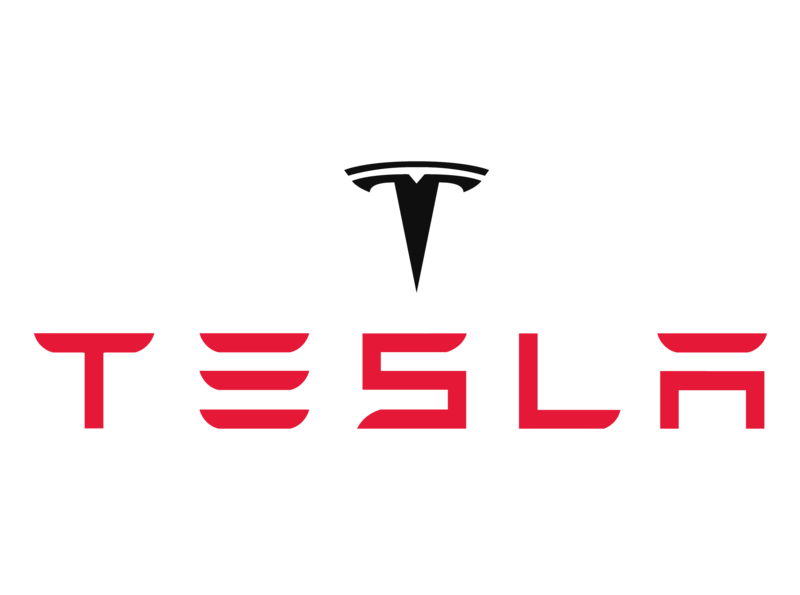

<!DOCTYPE html>
<html lang="en">

<head>
    <meta charset="UTF-8">
    <meta name="viewport" content="width=device-width, initial-scale=1.0">
    <title>Tesla Home</title>
    <link rel="stylesheet" href="./css/styles.css">
    <link rel="icon" type="image/x-icon" href="./assets/favico.ico">
</head>

<body>
    <header>
        <nav>
            
            <ul>
                <li><a href="#home">Home</a></li>
                <li><a href="#model3">Model 3</a></li>
                <li><a href="#modelx">Model X</a></li>
                <li><a href="#">Model Y</a></li>
                <li><a href="#models">Model S</a></li>
                <li><a href="#cybertruk">Cybertruk</a></li>
                <li><a href="https://shop.tesla.com">Shop</a></li>
            </ul>
            <a class="btn" href="#">Account</a>
        </nav>
    </header>
    <main>
        <section class="home" id="home">
            <video src="./assets//public_video.webm" muted autoplay loop></video>
            

                <h1 style="font-size: 40px;"><b>Tesla Motors</b></h1>
                
El futuro es sustentable...  Estamos construyendo un mundo impulsado por energía solar,
                     que funciona con baterías y se transporta mediante vehículos eléctricos.
                

                

                    <a class="demo" href="https://www.tesla.com/drive?selectedModel=model3">Demo Drive</a>
                

            

        </section>
        <section class="model3" id="model3">
            

                <h1>Model 3</h1>
                
Lease starting at $329/mo*

                

                    <a class="explore" href="https://www.tesla.com/inventory/new/m3">Explore Inventory</a>
                    <a class="demo" href="https://www.tesla.com/drive?selectedModel=model3">Demo Drive</a>
                

            

        </section>
        <section class="modelx" id="modelx">
            

                <h1>Model X</h1>
                
From $68,590*

                
After Federal Tax Credit y Est. Gas Savings

                

                    <a class="explore" href="https://www.tesla.com/inventory/new/m3">Explore Inventory</a>
                    <a class="demo" href="https://www.tesla.com/drive?selectedModel=model3">Demo Drive</a>
                

            

        </section>
        <section class="models" id="models">
            
                
                <h1>Model S</h1>
                
From $71,090*

                
After Est. Gas Savings

                

                    <a class="explore" href="https://www.tesla.com/inventory/new/m3">Explore Inventory</a>
                    <a class="demo" href="https://www.tesla.com/drive?selectedModel=model3">Demo Drive</a>
                

            

        </section>
        <section class="cybertruk" id="cybertruk">
            <video src="./assets/cybertruk_video.mp4" muted autoplay loop></video>
            

                <h1>Cybertruk</h1>
                
From $68,590*

                
After Federal Tax Credit y Est. Gas Savings

                

                    <a class="explore" href="https://www.tesla.com/cybertruck/design">Ordenar Ahora</a>
                    <a class="demo" href="https://www.tesla.com/cybertruck">Aprende más</a>
                

            

        </section>
    </main>
</body>

</html>
